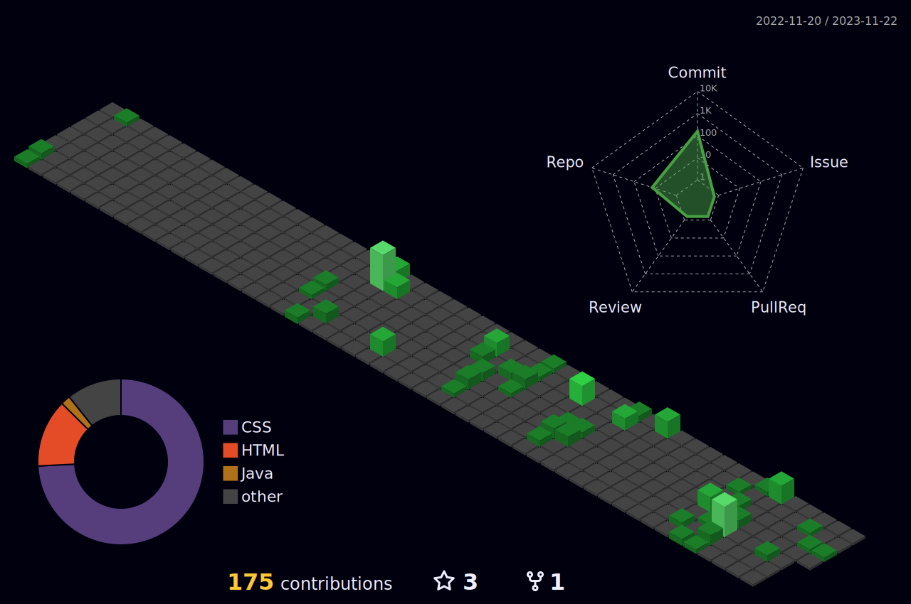

<h1 align="center"> Bem-vindo(a) ao perfil do Emanuel B. Fortes 😁</h1>
 
 

   <a href="https://github.com/emanuelbarbozafortes">
   
   

 
  
  
  

 
  
 
  <h3 align="center"> 🤩 Se você gostou do que viu me sinto honrado! 🤩</h3>
  <h4 align="center"> Da uma conferida nas minhas Redes Sociais,🖖 seja tardiu em sair daqui!!! 🖖</h4>
 

  
 
  
  
 

